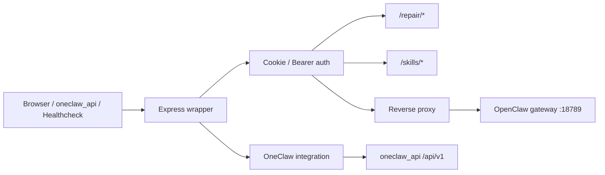
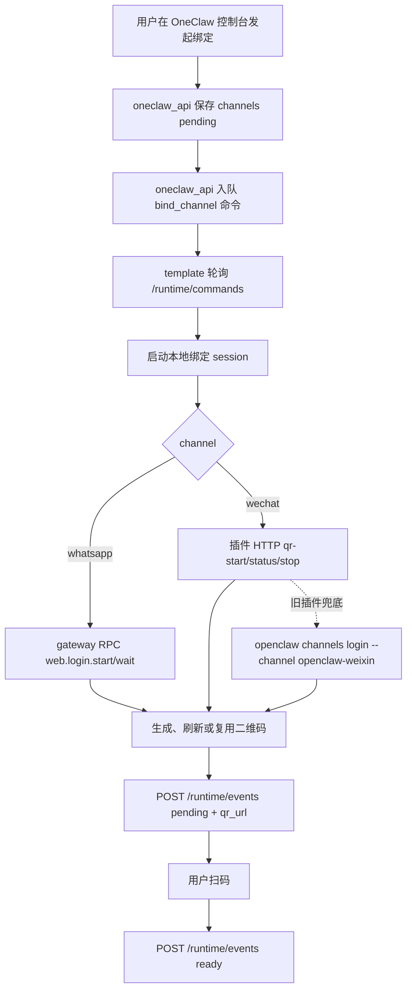
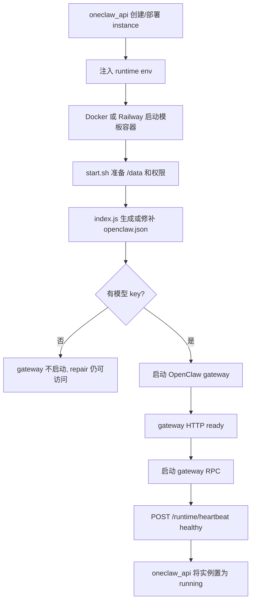
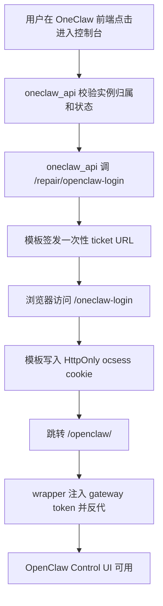
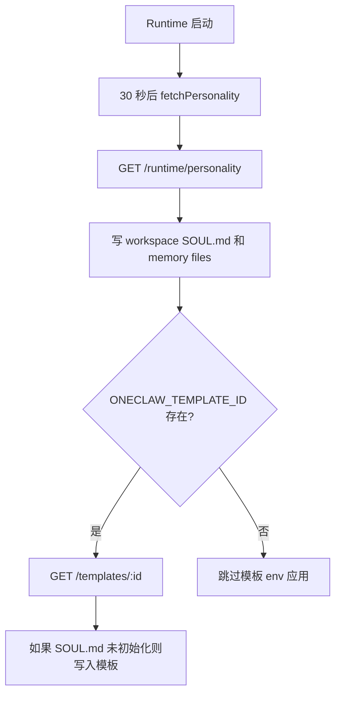
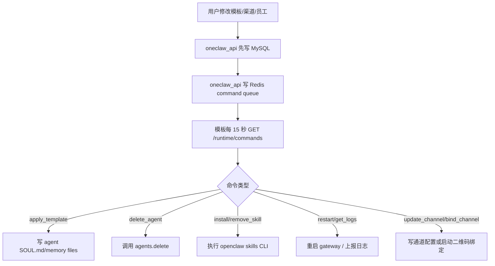
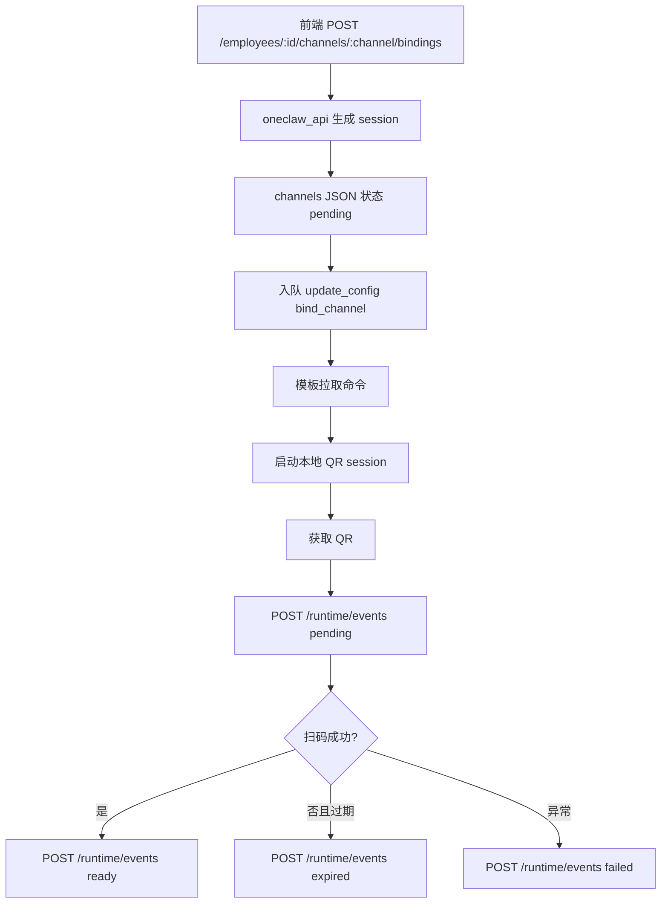
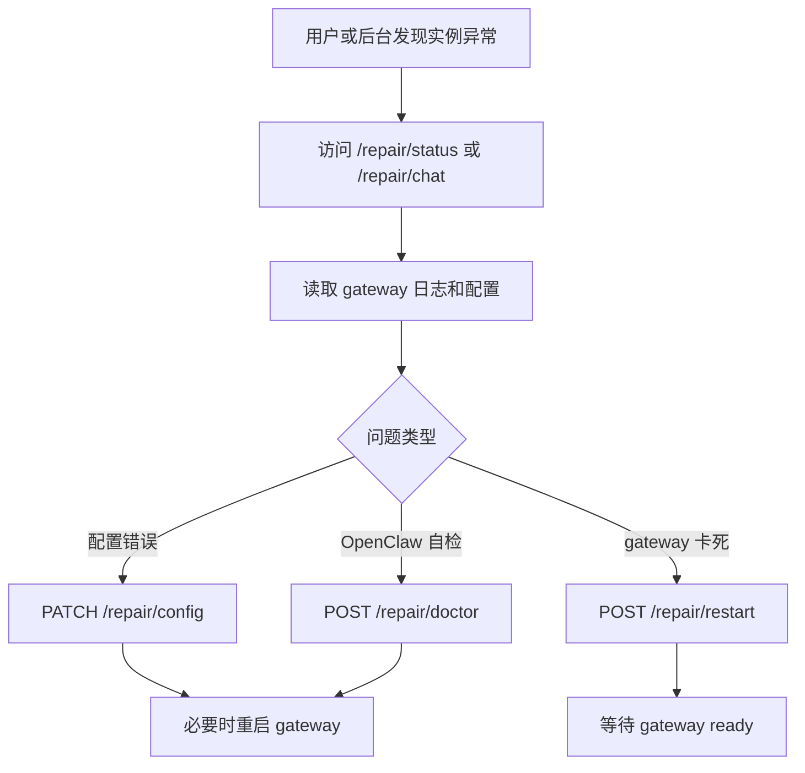

# OpenClaw Template V2 业务逻辑与业务流程梳理

本文档基于当前 `openclaw-template-v2` 代码梳理，覆盖运行时定位、启动链路、配置生成、代理鉴权、OneClaw 平台集成、修复能力、渠道绑定和与 `oneclaw_api` 的接口契约。主要参考文件包括 `src/index.js`、`src/config/`、`src/gateway/`、`src/proxy/`、`src/repair/`、`src/channels/`、`src/integration/oneclaw.js`、`Dockerfile`、`start.sh`。

## 1. 系统定位

`openclaw-template-v2` 是部署在 Railway 或 Docker 容器中的 OpenClaw Runtime wrapper。它不是用户前台页面，也不是 OneClaw 主后端，而是每个用户实例里的 sidecar 进程，负责把环境变量、OpenClaw gateway、控制台访问、修复接口和 OneClaw 平台心跳串起来。

核心职责：

- 运行 OpenClaw gateway，并在 gateway 崩溃时自动恢复。
- 根据环境变量生成或修补 `/data/.openclaw/openclaw.json`。
- 对外暴露统一 HTTP 入口，将 `/openclaw/*` 反向代理到内部 gateway。
- 用 cookie 和实例 secret 保护 Control UI、修复接口和技能接口。
- 向 `oneclaw_api` 上报心跳、统计、事件和渠道绑定状态。
- 从 `oneclaw_api` 拉取命令、提醒和人格模板，并同步到 OpenClaw。
- 提供 `/repair/*` 修复 API，用于诊断、重启、读取配置、登录控制台和二维码绑定。
- 持久化配置、凭证、workspace、渠道登录态到 Railway Volume `/data`。

## 2. 应用启动与分层

启动链路：

1. `start.sh` 设置 `OPENCLAW_STATE_DIR=/data/.openclaw` 和 `OPENCLAW_WORKSPACE_DIR=/data/workspace`。
2. 如果容器以 root 启动，先修复 `/data` 权限，再通过 `gosu openclaw` 降权运行。
3. `src/index.js` 读取环境变量，解析端口、state 目录、gateway token 和平台集成参数。
4. `ensureConfig()` 在首次启动时生成 `openclaw.json`，后续启动时幂等修补 token、端口、Control UI、插件路径和渠道配置。
5. 创建 gateway manager、gateway RPC、OneClaw integration、repair router、skills router、auth 和 reverse proxy。
6. Express 监听 `PORT`，提供健康检查、登录、修复、技能和反代入口。
7. 如果实例已配置，启动 OpenClaw gateway，gateway ready 后启动 RPC 连接、工作区文件补齐和模板应用。

代码分层：

- `src/index.js`：PID 1 主入口，编排配置、进程、路由和优雅退出。
- `src/config/`：从 env 构建 OpenClaw 配置，处理运行时默认值和插件加载路径。
- `src/gateway/`：管理 gateway 子进程和 wrapper 到 gateway 的内部 RPC WebSocket。
- `src/proxy/`：cookie/Bearer 鉴权、一次性浏览器登录票据、HTTP/WS 反向代理。
- `src/integration/`：对接 OneClaw API，负责心跳、命令、提醒、模板和渠道状态。
- `src/repair/`：修复助手、配置操作、二维码登录、OpenClaw 控制台登录。
- `src/channels/`：通道 manifest、配置写入、绑定关系和访问策略。
- `src/skills/`：安装、更新、删除技能的运行时接口。
- `src/public/`：登录页和 gateway 启动中页面。

请求流转：



## 3. 路由与鉴权模型

### 3.1 健康检查

- `GET /health`
- `GET /healthz`

健康检查只表示 wrapper 存活，并返回 `gatewayReady`。即使 OpenClaw gateway 崩溃，wrapper 仍返回 200，方便 Railway healthcheck 保持容器可访问，再由修复助手处理 gateway 问题。

### 3.2 登录与 Control UI

- `GET /login`
- `POST /login`
- `GET /oneclaw-login`
- `/openclaw/*`

登录方式：

- 浏览器普通访问：输入 `SETUP_PASSWORD`，成功后写入 `ocsess` HttpOnly cookie。
- OneClaw 平台跳转：平台服务端调用 `/repair/openclaw-login`，wrapper 创建一次性 ticket，浏览器访问 `/oneclaw-login?ticket=...` 后写 cookie。
- 本地开发：如果没有设置 `SETUP_PASSWORD` 且没有 `ONECLAW_INSTANCE_SECRET`，默认放行。

安全边界：

- `OPENCLAW_GATEWAY_TOKEN` 不返回给浏览器。
- wrapper 对内部 gateway 代理时注入 `Authorization: Bearer <gateway_token>`。
- WebSocket 也由 wrapper 注入 token，浏览器只依赖 cookie 或短期 ticket。

### 3.3 修复接口

修复接口挂载在 `/repair/*`，使用两种认证方式：

- `Authorization: Bearer <ONECLAW_INSTANCE_SECRET>`，供 `oneclaw_api` 服务端调用。
- 登录 cookie 或本地放行策略，供用户直接访问或调试。

主要端点：

- `GET /repair/status`：gateway 状态、修复 AI key 状态。
- `GET /repair/logs`：最近 gateway 日志。
- `GET /repair/config`：脱敏后的 `openclaw.json`。
- `PATCH /repair/config`：按 dot-path 修补配置。
- `POST /repair/restart`：后台重启 gateway。
- `POST /repair/doctor`：执行 `openclaw doctor --fix --yes`。
- `POST /repair/chat`：修复助手 SSE 对话。
- `POST /repair/openclaw-login`：签发浏览器进入 `/openclaw/` 的短期 URL。
- `POST /repair/whatsapp-login/start|wait`：通过 gateway RPC 获取 WhatsApp 二维码。
- `POST /repair/wechat-login/start`、`GET /repair/wechat-login`、`POST /repair/wechat-login/stop`：微信扫码登录进程管理。
- `GET /repair/channel-status`、`GET /repair/channel-bindings`、`POST /repair/bind-channel`、`POST /repair/unbind-channel`：运行时通道绑定状态和绑定关系操作。

### 3.4 技能接口

- `POST /skills/install`
- `POST /skills/update`
- `DELETE /skills/:slug?agentId=...`

技能接口同样需要 wrapper 鉴权。安装支持两种来源：

- ClawHub slug。
- 自定义 `downloadUrl` zip，下载到 `/tmp` 后安装到指定 agent。

## 4. 核心业务域

### 4.1 配置生成与持久化

核心文件：`src/config/generate.js`、`src/config/runtime-defaults.js`、`src/config/plugins.js`。

首次启动时，如果存在至少一个模型 provider key，wrapper 会生成 `openclaw.json`：

1. 选择 provider，优先级为 `CLAWROUTERS_API_KEY`、Anthropic、OpenAI、Gemini、OpenRouter、DeepSeek。
2. 写入 gateway 配置：loopback、内部端口、token auth、`/openclaw` basePath、allowed origins。
3. 写入 models provider。ClawRouters 使用 env secret ref，不把 key 明文写入配置。
4. 写入 agent defaults，包括 workspace、默认模型、heartbeat、上下文压缩和 ClawRouters memory search。
5. 写入插件加载路径 `/opt/openclaw-plugins`。
6. 写入 Telegram、Discord、Slack、Feishu、WhatsApp、WeChat 渠道配置。
7. 生成 `session.dmScope=per-channel-peer` 和 `tools.profile=full`。

后续启动时，如果配置已存在，wrapper 不重建整份配置，而是修补：

- gateway token、端口、bind、trusted proxies。
- Control UI base path 和 allowed origins。
- 预装插件 install records。
- runtime defaults。
- 当前 env 中启用的通道。

不变量：

- `OPENCLAW_STATE_DIR` 必须落在持久化 volume，否则 gateway token、配置和渠道登录态会在重新部署后丢失。
- `OPENCLAW_GATEWAY_TOKEN` 未设置时自动生成并写入 `${STATE_DIR}/gateway.token`。
- 配置生成只在有模型 key 时进行；没有 provider key 时 gateway 不启动。

### 4.2 Gateway 生命周期

核心文件：`src/gateway/manager.js`。

gateway manager 负责：

1. 通过 `node <OPENCLAW_ENTRY> gateway run --bind loopback --port 18789 --auth token` 启动 gateway。
2. 等待 `/openclaw`、`/` 或 `/health` 任一内部 HTTP 端点可访问。
3. 将 gateway stdout/stderr 存入 500 行 ring buffer，供修复接口读取。
4. gateway 意外退出时，按指数退避自动重启，最多 5 次。
5. 用户主动重启或进程退出时，避免重复自愈。
6. 如果 gateway runner 退出但 HTTP 仍可访问，则采用已有 gateway。

状态语义：

- `gatewayStarting=true`：正在启动或重启。
- `gatewayReady=true`：gateway 进程存在或内部 HTTP 已可达，且不在启动中。
- wrapper 的 `/health` 和 `/repair/*` 不依赖 gateway ready。

### 4.3 反向代理与 WebSocket

核心文件：`src/proxy/reverse-proxy.js`、`src/index.js`。

对 `/openclaw*`：

1. 先验证 cookie、实例 secret 或 query token。
2. 如果 gateway 正在启动，返回 `loading.html`。
3. `/openclaw/chat` 缺少 `gatewayUrl` 时，按当前公网 host 自动补一个同源 WS URL。
4. 通过 http-proxy 转发到 `http://127.0.0.1:18789`。
5. 代理层注入 `Authorization: Bearer <OPENCLAW_GATEWAY_TOKEN>` 和内部 Origin。
6. 剥离入站 `X-Forwarded-*`、`Forwarded`、`X-Real-IP`，避免 gateway 误判为非本地请求并触发 device pairing。

WebSocket 升级：

- 浏览器先通过 cookie 鉴权。
- wrapper 将每个前端客户端直接代理到 gateway，避免多客户端共用一个 WS 导致事件串线。
- wrapper 的内部 gateway RPC 连接只用于自身调用，例如二维码登录和 agent/template 同步。

### 4.4 OneClaw 平台集成

核心文件：`src/integration/oneclaw.js`。

当以下 env 完整时启用：

- `ONECLAW_API_URL`
- `ONECLAW_INSTANCE_ID`
- `ONECLAW_INSTANCE_SECRET`

`ONECLAW_API_URL` 会规范化：

- 传 `https://host/api/v1`：保持不变。
- 传 `https://host/api`：补成 `/api/v1`。
- 传 `https://host`：补成 `/api/v1`。

平台通信统一带 `Authorization: Bearer <ONECLAW_INSTANCE_SECRET>`。

上报与拉取：

- `POST /runtime/heartbeat`：2 小时周期，也会在启动 30 秒后和 gateway ready 后立即发送。
- `POST /runtime/events`：上报 `instance_started`、runtime command 执行结果、日志快照等事件。
- `POST /runtime/events`：上报本地累计 messages/tokens，目前只在 `trackMessage()` 被调用后才有数据。
- `GET /runtime/personality`：拉取实例人格和模板。
- `GET /templates/:id`：按 `ONECLAW_TEMPLATE_ID` 应用模板。
- `GET /runtime/commands`：默认每 15 秒轮询一次命令。
- `POST /runtime/events`：回写二维码绑定 pending/ready/failed/expired。

心跳 payload：

- `instance_id`
- `status`：`healthy`、`starting`、`unhealthy`
- `status_reason`
- `agent.timestamp`
- `agent.uptime_seconds`
- `agent.gateway_ready`
- `agent.platforms`：Telegram、Discord、Feishu、WhatsApp、WeChat 当前运行态。

### 4.5 命令执行

Runtime 从 Go API 心跳响应或 `/runtime/commands` 拉取命令。模板当前处理的命令：

- `restart`
- `apply_template`
- `install_skill`
- `remove_skill`
- `delete_agent`
- `get_logs`
- `update_config` 中的 `update_channel`、`bind_channel`、`cancel_bind_channel`、`unbind_channel`

`restart`：

1. 调用 gateway manager 的非阻塞重启。
2. 重启内部 gateway RPC 连接。
3. 通过 `agent/event` 上报命令已接受执行。

`apply_template`：

1. 如果 payload 带 `employee_id`，通过 gateway RPC 创建或定位稳定 agent：`oneclaw-<employee_id>`。
2. 写入该 agent 的 `SOUL.md` 和 memory files。
3. 如果没有 `employee_id`，写入 workspace 级 `SOUL.md` 和 memory files。

`delete_agent`：

1. 优先使用 `openclaw_agent_id` 或 `agent_id`。
2. 否则根据 `employee_id` 推导 `oneclaw-<employee_id>`。
3. 调用 gateway RPC `agents.delete`，错误按可容忍处理。

`install_skill`：

1. 通过 `employee_id` 定位或创建稳定 agent。
2. 执行 `openclaw skills install <slug> --agent <agentId>`。
3. 支持 payload 中的 `version` 和 `force`。

`remove_skill`：

1. 通过 `employee_id` 推导稳定 agent。
2. 读取 `openclaw skills list --agent <agentId> --json` 获取技能目录。
3. 删除目标技能目录。

`get_logs`：

1. 从 gateway 日志 ring buffer 读取最近 N 行。
2. 通过 `agent/event` 上报 `runtime_logs`。

`update_config.update_channel`：

1. 将 Go API 的 `wechat` 映射为 OpenClaw runtime 的 `openclaw-weixin`。
2. 合并 channels JSON 中的 config、secrets 和 access policy。
3. 直接写入 `openclaw.json` 的 `channels.<id>`，必要时启用对应 plugin entry。

`update_config.bind_channel`：

1. 校验 channel、employee id、session id、expires_at。
2. 只处理 `whatsapp` 和 `wechat`。
3. 确保二维码通道 runtime 配置存在。
4. 启动一次性绑定 session。
5. 在 session 过期前持续拉二维码或登录状态；WeChat 同账号已有可用二维码时复用缓存，不重复生成。
6. 每次二维码刷新或状态变化回写 `/runtime/events`。

当前需要注意：

- 技能安装命令已执行 OpenClaw CLI，但安装结果仍未回写 Go API 的 employee skill 状态；Go API 当前仍以本地 `installing/removed` 记录为准。
- `agent/stats` 端点已对齐为轻量接收，正式 Credits 消耗仍应继续以 ClawRouters 和 Go API 自身流水为准。

### 4.6 渠道配置与二维码绑定

核心文件：`src/channels/manifest.js`、`src/channels/access-policy.js`、`src/repair/qr-login.js`。

支持通道：

- `telegram`
- `discord`
- `slack`
- `feishu`
- `whatsapp`
- `openclaw-weixin`，对应 Go API 展示层的 `wechat`

通道配置来源：

- Token 类通道：部署 env 中的 token 或 app id/secret。
- QR 类通道：`WHATSAPP_ENABLED=1`、`WECHAT_ENABLED=1` 或 `WEIXIN_ENABLED=1` 启用插件和 channel，登录态在运行时扫码获得。
- 访问策略：Go API command payload 中的 `state.config.access` 可被转换成 OpenClaw runtime policy。

二维码绑定流程：



绑定生命周期：

- Go API 下发的 `binding.expires_at` 是整次绑定的唯一截止时间，会从 template 透传到微信插件 HTTP session；刷新单张二维码不会延长总截止时间。
- 微信插件在截止时间前自动刷新失效二维码；补丁通过 `onQrRefreshed` 更新 HTTP session，`qr-status` 返回最新 `qrDataUrl`，template 再用原 `session_id` 上报 Go API。
- 微信上游没有提供准确的单张二维码过期时间时不伪造 `qr_expires_at`，改用 `qrUpdatedAt` 标识二维码版本更新时间。
- 到期后 template 停止轮询、调用插件 `qr-stop` 取消后台 waiter，并上报 `expired`。正在执行的上游长轮询可以结束，但其结果会被丢弃，不能再触发刷新或成功回写。
- 用户取消绑定时，Go API 入队 `cancel_bind_channel`，模板停止本地 session。
- 微信取消时会额外调用 `wechat-login/stop`；HTTP 快速路径先按 `sessionKey` 调用插件 `qr-stop`，CLI fallback 则终止登录子进程。
- WhatsApp 使用 `accountId=employee_id` 隔离多员工账号。
- WhatsApp 的 `web.login.wait` 会返回最新二维码；取消后晚到的单次 wait 结果由 template 的 `session.cancelled` 守卫丢弃。

### 4.7 修复助手

核心文件：`src/repair/assistant.js`。

修复助手是一个运行在实例内的诊断 API，不直接依赖 Go API。它从当前模型 provider key 读取修复 AI key，支持 SSE 对话和工具调用。

工具能力：

- `get_status`：读取 gateway ready/starting 和 wrapper uptime。
- `read_logs`：读取内存日志。
- `read_config`：读取脱敏配置。
- `run_doctor`：运行 OpenClaw doctor。
- `restart_gateway`：后台重启 gateway。
- `patch_config`：写入 openclaw.json dot-path。
- `run_openclaw`：执行白名单 CLI 子命令。

修复助手适合处理：

- gateway 无法启动。
- Control UI 无法访问。
- channel 配置错误。
- 插件加载异常。
- provider key 或 model 配置异常。

### 4.8 Docker 与 Railway 部署模型

镜像构建：

- 基础镜像：`node:22-bookworm`。
- 安装 OpenClaw core，当前 Dockerfile pin 到 `openclaw@2026.6.10`。
- 预装 ClawRouters、Slack、Discord、Feishu、WhatsApp、WeChat 插件到 `/opt/openclaw-plugins`。
- 安装 wrapper 依赖 `express`、`http-proxy`、`ws`。
- 运行时通过 `start.sh` 启动。

Railway：

- `PORT` 由 Railway 注入，默认 8080。
- 需要挂载 `/data` volume。
- 公开域名由 Railway public networking 分配。
- Go API 的 Railway provider 创建 project/service/domain，并注入 env。

Docker：

- 可本地或远程 SSH 部署同一镜像。
- 需要映射容器端口 8080。
- 需要挂载持久化目录到 `/data`，否则重新部署后状态会丢失。

## 5. 与 oneclaw_api 的对齐检查

### 5.1 已对齐的契约

部署 env：

| Go API 注入 | 模板读取 | 用途 |
| --- | --- | --- |
| `PORT` | `src/index.js`、`start.sh` | wrapper 对外端口 |
| `ONECLAW_API_URL` | `normalizeOneclawApiUrl()` | 平台 API base URL，自动补 `/api/v1` |
| `ONECLAW_INSTANCE_ID` | `createOneclawIntegration()` | Runtime 身份 |
| `ONECLAW_INSTANCE_SECRET` | auth、platform API | Runtime 到平台鉴权，以及平台访问 `/repair/*` |
| `ONECLAW_TEMPLATE_ID` | `applyTemplateFromEnv()` | 首次启动应用模板 |
| `CLAWROUTERS_API_KEY` | config generator | 模型 provider 和媒体生成 |
| `CLAWROUTERS_BASE_URL` | runtime defaults | ClawRouters API base |
| `OPENCLAW_GATEWAY_TOKEN` | gateway auth、proxy | 内部 gateway bearer token |
| `SETUP_PASSWORD` | login auth | Control UI 登录密码 |
| `WHATSAPP_ENABLED`、`WECHAT_ENABLED` | channel manifest | 启用 QR 通道插件 |

Agent API：

| 模板调用 | Go API 路由 | 对齐状态 |
| --- | --- | --- |
| `POST /runtime/heartbeat` | `POST /api/v1/runtime/heartbeat` | 已对齐 |
| `GET /runtime/personality?instance_id=...` | `GET /api/v1/runtime/personality` | 已对齐 |
| `GET /runtime/commands?instance_id=...&limit=10` | `GET /api/v1/runtime/commands` | 已对齐 |
| `POST /runtime/events` | `POST /api/v1/runtime/events` | 已对齐 |
| `POST /runtime/events` | `POST /api/v1/runtime/events` | 已对齐，当前后端轻量接收 |
| `POST /runtime/events` | `POST /api/v1/runtime/events` | 已对齐，当前后端轻量接收 |

定时任务不再通过平台轮询兼容层执行。Go API 通过员工接口保存任务后，下发 `upsert_cron_task`、`delete_cron_task`、`run_cron_task` 命令；模板收到后调用 OpenClaw gateway 原生 `cron.add`、`cron.update`、`cron.remove`、`cron.run`。由于 OpenClaw `cron.add` 会生成原生 job id，模板在 `stateDir/oneclaw-cron-tasks.json` 维护 OneClaw 任务 ID 到 OpenClaw job id 的映射，并使用任务名前缀作为兜底恢复线索。

运行时控制台：

| Go API 调用 | 模板接口 | 对齐状态 |
| --- | --- | --- |
| `POST /instances/:id/runtime-sessions` 后端服务端请求 | `POST /repair/openclaw-login` | 已对齐 |
| 浏览器跳转一次性 URL | `GET /oneclaw-login` | 已对齐 |
| Go API runtime WS proxy | `/openclaw` gateway WS | 已对齐，token 不暴露给前端 |

渠道绑定：

| Go API payload | 模板消费 | 对齐状态 |
| --- | --- | --- |
| `type=update_config, action=bind_channel` | `startChannelBindingSession()` | 已对齐 |
| `state.binding.session_id` | session key | 已对齐 |
| `state.binding.expires_at` | session 截止时间 | 已对齐 |
| `employee_id` | WhatsApp accountId / WeChat accountId | 已对齐 |
| `channel=wechat` | 映射到 runtime `openclaw-weixin` | 已对齐 |
| `POST /runtime/events` 的 `session_id` | Go API 校验当前 session | 已对齐 |

基础设施扣费：

- 模板本身不读取 Railway usage，也不做扣费。
- Go API 通过 Railway GraphQL 拉 usage，并通过 `/cron/infra-charge` 做 Credits/CR charge 同步。
- 模板只需要保证 Railway project/service/domain metadata 被 Go API provider 记录，后续由 Go API 的 Railway usage cursor 处理。

### 5.2 需要核实或补齐的点

1. 统计口径

模板有 `trackMessage()` 和 `/runtime/events` 上报逻辑，但当前代码未看到代理层或 gateway RPC 对聊天消息调用 `trackMessage()`。因此 `messages/tokens` 统计可能长期为 0。正式计费不应依赖这里，Credits 消耗应继续以 ClawRouters 和 Go API 自身流水为准。

2. 技能状态回写

Go API 会把技能安装记录置为 `installing`，template 已能执行安装/卸载命令，但尚未把执行结果回写为 `active/failed`。后续可新增 `POST /runtime/events` 或复用 `agent/event` 进行状态对账。

## 6. 关键业务流程

### 6.1 部署到 Runtime ready



### 6.2 用户进入 OpenClaw 控制台



### 6.3 人格和模板同步



### 6.4 异步命令同步



### 6.5 二维码通道绑定



### 6.6 Gateway 修复



## 7. 运行时数据与状态

持久化目录：

- `/data/.openclaw/openclaw.json`：OpenClaw 主配置。
- `/data/.openclaw/gateway.token`：自动生成的 gateway token。
- `/data/.openclaw/credentials`：通道凭证和 pairing 状态。
- `/data/.openclaw/oauth/whatsapp`：WhatsApp 多账号登录态。
- `/data/workspace`：workspace、SOUL.md、AGENTS.md、memory files。
- `/opt/openclaw-plugins`：镜像预装插件，只读随镜像发布，不在 volume 内。

运行态内存：

- gateway process handle。
- gateway 日志 ring buffer。
- wrapper 到 gateway 的 RPC WebSocket。
- 一次性浏览器登录 ticket。
- 正在进行的 QR channel binding sessions。
- usageStats 计数器。

## 8. 外部依赖

- OpenClaw core：gateway、Control UI、CLI、agent、channel 和 skill 能力。
- ClawRouters：推荐模型 provider、图像/视频模型、memory search、用户 child key。
- OneClaw API：实例心跳、命令队列、人格模板、提醒、渠道状态。
- Railway：生产部署和 `/data` volume。
- Docker：本地或测试环境部署同一镜像。
- 第三方通道：Telegram、Discord、Slack、Feishu、WhatsApp、WeChat。

## 9. 排查入口

常用检查：

- `GET /health`：wrapper 是否存活。
- `GET /repair/status`：gateway 是否 ready，修复 AI 是否可用。
- `GET /repair/logs?n=200`：gateway 最近日志。
- `GET /repair/config`：脱敏配置。
- `GET /repair/whatsapp-login/diagnostics`：WhatsApp 插件、账号、凭证和日志。
- `POST /repair/restart`：重启 gateway。
- `POST /repair/openclaw-login`：验证 OneClaw 平台进入控制台链路。

本地运行：

```bash
pnpm dev
pnpm test
node --test test/oneclaw-go-api.test.js
```

## 10. 总结

`openclaw-template-v2` 的业务核心是“实例运行时代理层”：它把用户部署出来的容器变成可被 OneClaw API 管理、可恢复、可进入控制台、可绑定消息通道的 OpenClaw runtime。与 `oneclaw_api` 的主链路已经基本对齐，尤其是部署 env、心跳、命令队列、控制台登录和二维码绑定。

当前最值得继续补齐的是两类能力：技能安装结果回写，以及真正持久化的提醒/事件/统计模型。现阶段 Go API 和模板容器之间的主要运行时契约已经闭环，后台管理接口可以更放心地下发运行时操作。
